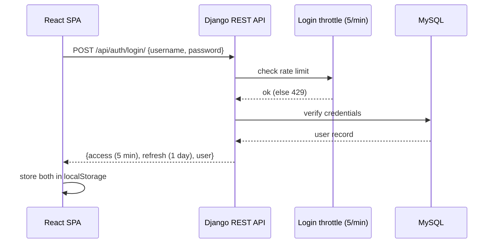
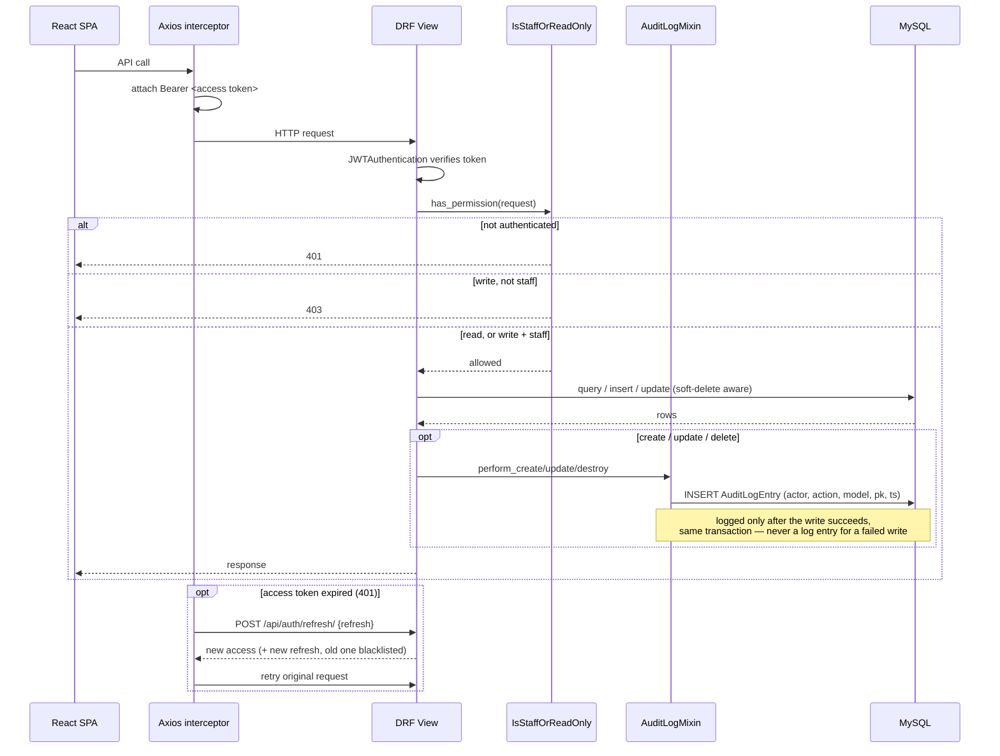

# Architecture

Two diagrams: how a request moves through the system, and how the domain
data is shaped. This is a living reference, not a decision record — see
`notes/` for the dated write-ups behind individual choices (RBAC, audit
log, CSP, etc.) and `CLAUDE.md` for the invariants that make this schema
unusual to work in.

## System flow

### Login



`auth/login/`, `auth/refresh/`, and the two health probes are the only
`AllowAny` endpoints in the project — everything else requires a bearer
token by default (`IsStaffOrReadOnly` in `hms/permissions.py`).

### An authenticated request (read or write)



Any authenticated account can read. Only `is_staff` accounts can
create/update/delete — see `notes/RBAC_STAFF_WRITE_GATE_2026-09-09.md` for
why this is staff-vs-everyone rather than keyed to `Employee.role`.

## Data model

Entities as Django exposes them (`back/hms/models.py`) — the FK arrows
follow the ORM relationships, not always the literal DB constraint (see
note below the diagram).

```mermaid
erDiagram
    PERSON ||--o| EMPLOYEE : "is (SSN)"
    PERSON ||--o| FACILITY : "manages (SSN → GMSSN)"
    PERSON ||--o{ INFECTION : "has (SSN)"
    PERSON ||--o{ VACCINATION : "has (SSN)"
    INFECTION_TYPE ||--o{ INFECTION : classifies
    VACCINE_TYPE ||--o{ VACCINATION : classifies
    FACILITY ||--o{ VACCINATION : "administered at"
    EMPLOYEE ||--o{ EMPLOYMENT : has
    FACILITY ||--o{ EMPLOYMENT : has
    EMPLOYEE ||--o{ SCHEDULE : works
    FACILITY ||--o{ SCHEDULE : hosts

    PERSON {
        char36 UUID PK_public "opaque id, the only one allowed in a URL"
        varchar12 Medicare PK_real "MySQL PRIMARY KEY, never in a URL"
        int SSN UK "logical join key for 6 tables, never in a URL"
        string FirstName
        string LastName
        date DOB
        datetime DeletedAt "soft delete"
    }
    EMPLOYEE {
        int SSN PK_FK "= Person.SSN"
        enum Role
    }
    FACILITY {
        int FID PK
        string Name
        enum Type
        int GMSSN FK "general manager"
    }
    RESIDENCE {
        int ResID PK
        string Address
        enum Type
    }
    INFECTION_TYPE {
        int TypeID PK
        string TypeName
    }
    INFECTION {
        int SSN PK_FK
        int TypeID PK_FK
        date Date PK
    }
    VACCINE_TYPE {
        int TypeID PK
        string TypeName
    }
    VACCINATION {
        int SSN PK_FK
        int TypeID PK_FK
        date Date PK
        int FID FK "nullable"
        int NoOfDose
    }
    EMPLOYMENT {
        int ESSN PK_FK
        int FID PK_FK
        date StartDate PK
        date EndDate
    }
    SCHEDULE {
        int ESSN PK_FK
        int FID PK_FK
        date Date PK
        time StartTime PK
        time EndTime
    }
```

Three IDs, three jobs (full explanation in `CLAUDE.md`): **Medicare** is
the real MySQL primary key, **SSN** is the join key every relationship
above actually travels on, **UUID** is the only one of the three ever
allowed in a URL.

**Not in this diagram — tables MySQL has that Django doesn't model, so
there's no API for them:** `Resides` (Person ↔ Residence, i.e. what
`RESIDENCE` above is for), `ResidesWith` (Employee ↔ Person), `EmailLogs`.
`Residence` itself _is_ exposed (`/residences/`), just not linked to
`Person` on the Django side despite the FK existing in MySQL. Confirm
against `back/schema.sql` before relying on this list — it reflects the
schema at the time this diagram was written, and nothing regenerates it
automatically.
